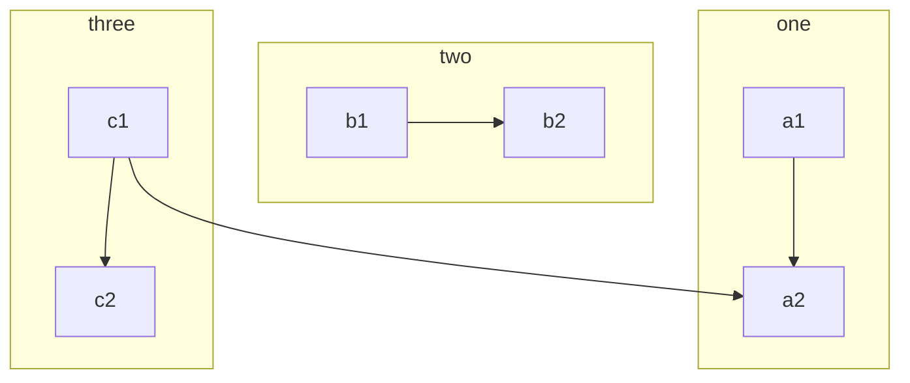
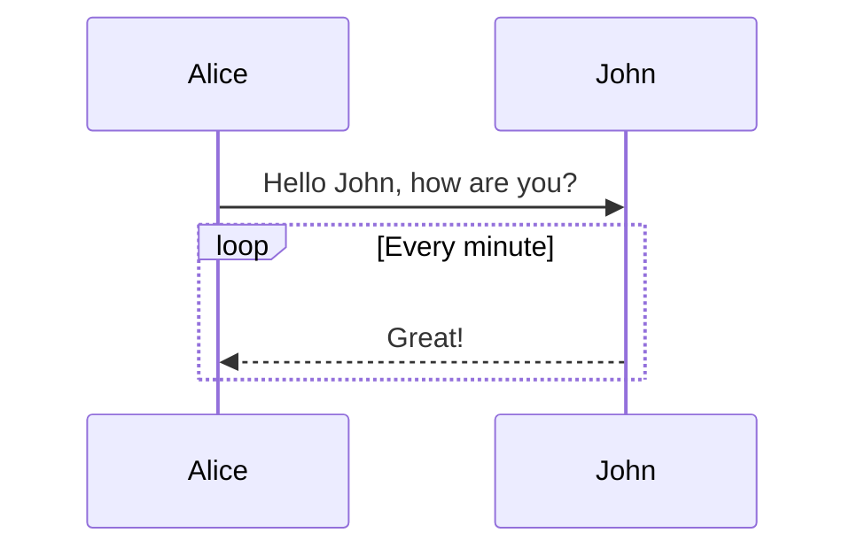
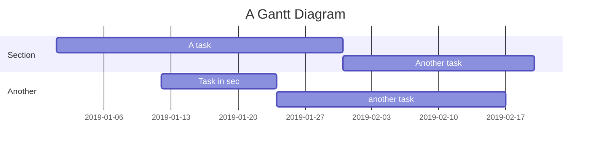
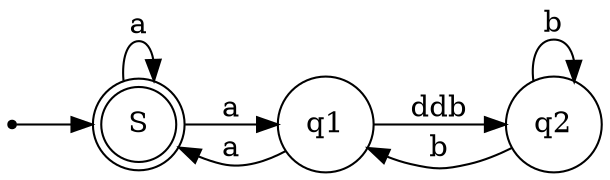

## 教程
{: id="20200825162110-ybv7poc"}

这是一篇讲解如何正确使用 **Markdown** 的排版示例，学会这个很有必要，能让你的文章有更佳清晰的排版。
{: id="20200825184421-mm6m1sc"}

> 引用文本：Markdown is a text formatting syntax inspired
> {: id="20200915213601-7l2zzrj"}
{: id="20200825184421-qxcpqm3"}

## 语法指导
{: id="20200825184421-ra429s9"}

### 内容块引用
{: id="20200923125442-deklsd6"}

`((20200817123136-in6y5m1 "内容块引用"))`
{: id="20200923125701-nt6hmus"}

((20200817123136-in6y5m1 "内容块引用"))
{: id="20200923125526-last67f"}

### 内容块嵌入
{: id="20200923125500-rd4xd94"}

`!((20200817123136-in6y5m1 "内容块嵌入​"))​`
{: id="20200923125705-bk4egbx"}

!((20200920190726-xw7fial "内容块嵌入"))
### 普通内容
{: id="20200825184421-1ac9ol6"}

这段内容展示了在内容里面一些排版格式，比如：
{: id="20200825184421-5newdw4"}

- **加粗** - `**加粗**`
- *倾斜* - `*倾斜*`
- ~~删除线~~ - `~~删除线~~`
- `Code 标记` - `` `Code 标记` ``
- [超级链接](https://ld246.com) - `[超级链接](https://ld246.com)`
- [username@gmail.com](mailto:username@gmail.com) - `[username@gmail.com](mailto:username@gmail.com)`
{: id="20200825184421-97etrs6"}

### 表情符号 Emoji
{: id="20200825184421-pyfhnm0"}

支持大部分标准的表情符号，可使用输入法直接输入，也可手动输入字符格式。通过输入 `:` 触发自动完成。
{: id="20200825184421-t3hskw8"}

#### 一些表情例子
{: id="20200825184421-w93c4ha"}

:smile: :laughing: :dizzy_face: :sob: :cold_sweat: :sweat_smile:  :cry: :triumph: :heart_eyes: :relieved::+1: :-1: :100: :clap: :bell: :gift: :question: :bomb: :heart: :coffee: :cyclone: :bow: :kiss: :pray: :anger:
{: id="20200825184421-di8byts"}

### 标题
{: id="20200825184421-nrj96w9"}

使用一个 `#` 是一级标题，两个 `##` 是二级标题，以此类推，最多支持六级标题。
{: id="20200825184421-lmnn12e"}

> NOTE: 别忘了 # 后面需要有空格！
> {: id="20200915213601-52814nk"}
{: id="20200825184421-2t4xh5h"}

### 图片
{: id="20200825184421-zkevah4"}

```


```
{: id="20200915213601-6of6n8j"}

支持直接复制粘贴。
{: id="20200825184421-zu8e9m0"}

### 代码块
{: id="20200825184421-cuxrywg"}

#### 普通
{: id="20200825184421-ecwvfnt"}

```
*emphasize*    **strong**
_emphasize_    __strong__
var a = 1
```
{: id="20200915213601-domy3dc"}

#### 语法高亮支持
{: id="20200825184421-uz1n975"}

如果在 ``` 后面跟随语言名称，可以有语法高亮的效果哦，比如：
{: id="20200825184421-o4z357u"}

##### 演示 Go 代码高亮
{: id="20200825184421-9h6t2bn"}

```go
package main

import "fmt"

func main() {
	fmt.Println("Hello, 世界")
}
```
{: id="20200915213601-8k8i0ng"}

##### 演示 Java 高亮
{: id="20200825184421-bqyhqzu"}

```java
public class HelloWorld {

    public static void main(String[] args) {
        System.out.println("Hello World!");
    }

}
```
{: id="20200915213601-p9a5bt1"}

> Tip: 语言名称支持下面这些： `ruby`, `python`, `js`, `html`, `erb`, `css`, `coffee`, `bash`, `json`, `yml`, `xml` ...
> {: id="20200915213601-jqmf9t0"}
{: id="20200825184421-uoih3pi"}

### 有序、无序、任务列表
{: id="20200825184421-fube5hs"}

#### 无序列表
{: id="20200825184421-hh0wyu7"}

- Java
  {: id="20200924094055-e48wanb"}

  - Spring
    - IoC
    - AOP
    {: id="20200915213601-7rtr2ps"}
  {: id="20200915213601-na3og1a"}
- Go
  {: id="20200924094055-j2owwv5"}

  - gofmt
  - Wide
  {: id="20200915213601-wovxuhk"}
- Node.js
  {: id="20200924094055-k6apm3s"}

  - Koa
  - Express
  {: id="20200915213601-bqaktmt"}
{: id="20200825184421-rfcfxdz"}

#### 有序列表
{: id="20200825184421-q538396"}

1. Node.js
   {: id="20200924094055-o31zg0s"}

   1. Express
   2. Koa
   3. Sails
   {: id="20200915213601-mvd6khm"}
2. Go
   {: id="20200924094055-zjmyojy"}

   1. gofmt
   2. Wide
   {: id="20200915213601-t485qjr"}
3. Java
   {: id="20200924094055-oiskldq"}

   1. Latke
   2. IDEA
   {: id="20200915213601-y1ty891"}
{: id="20200825184421-tp873x3"}

#### 任务列表
{: id="20200825184421-y3y5pav"}

- [X] 发布 Sym
- [X] 发布 Solo
- [ ] 预约牙医
{: id="20200825184421-5a4ve37"}

### 表格
{: id="20200825184421-dd1xdaf"}

如果需要展示数据什么的，可以选择使用表格。
{: id="20200825184421-dl9w7nx"}

| header 1 | header 2 |
| - | - |
| cell 1 | cell 2 |
| cell 3 | cell 4 |
| cell 5 | cell 6 |
{: id="20200825184421-kkhuvju"}

### 段落
{: id="20200825210629-co73w6x"}

空行可以将内容进行分段，便于阅读。（这是第一段）
{: id="20200825210631-53m9tac"}

使用空行在 Markdown 排版中相当重要。（这是第二段）
{: id="20200825184421-q4qli6k"}

### 链接引用
{: id="20200825184421-kfcjkw7"}

[链接文本][链接标识]
{: id="20200825184421-o0rnnsw"}

```
[链接文本][链接标识]

[链接标识]: https://b3log.org
```
{: id="20200915213601-dyt6gc0"}

### 数学公式
{: id="20200825184421-bdnt0a8"}

多行公式块：
{: id="20200825184421-mnsr524"}

$$
\frac{1}{
  \Bigl(\sqrt{\phi \sqrt{5}}-\phi\Bigr) e^{
  \frac25 \pi}} = 1+\frac{e^{-2\pi}} {1+\frac{e^{-4\pi}} {
    1+\frac{e^{-6\pi}}
    {1+\frac{e^{-8\pi}}{1+\cdots}}
  }
}
$$
{: id="20200829113831-16bk62r"}

行内公式：
{: id="20200825184421-b8vo385"}

公式 $a^2 + b^2 = \color{red}c^2$ 是行内。
{: id="20200825184421-w7gazta"}

### 脑图
{: id="20200825184421-ty507mw"}

```mindmap
- 教程
- 语法指导
  - 普通内容
  - 提及用户
  - 表情符号 Emoji
    - 一些表情例子
  - 大标题 - Heading 3
    - Heading 4
      - Heading 5
        - Heading 6
  - 图片
  - 代码块
    - 普通
    - 语法高亮支持
      - 演示 Go 代码高亮
      - 演示 Java 高亮
  - 有序、无序、任务列表
    - 无序列表
    - 有序列表
    - 任务列表
  - 表格
  - 隐藏细节
  - 段落
  - 链接引用
  - 数学公式
  - 脑图
  - 流程图
  - 时序图
  - 甘特图
  - 图表
  - 五线谱
  - Graphviz
  - 多媒体
  - 脚注
- 快捷键
```
{: id="20200915213601-vgqnevy"}

### 流程图
{: id="20200825184421-0k6pvep"}


{: id="20200915213601-lsqig8c"}

### 时序图
{: id="20200825184421-qwv7xfk"}


{: id="20200915213601-p1kz4eq"}

### 甘特图
{: id="20200825184421-9u4v4tb"}


{: id="20200915213601-lmdg6k1"}

### 图表
{: id="20200825184421-ris8prw"}

```echarts
{
  "title": { "text": "最近 30 天" },
  "tooltip": { "trigger": "axis", "axisPointer": { "lineStyle": { "width": 0 } } },
  "legend": { "data": ["帖子", "用户", "回帖"] },
  "xAxis": [{
      "type": "category",
      "boundaryGap": false,
      "data": ["2019-05-08","2019-05-09","2019-05-10","2019-05-11","2019-05-12","2019-05-13","2019-05-14","2019-05-15","2019-05-16","2019-05-17","2019-05-18","2019-05-19","2019-05-20","2019-05-21","2019-05-22","2019-05-23","2019-05-24","2019-05-25","2019-05-26","2019-05-27","2019-05-28","2019-05-29","2019-05-30","2019-05-31","2019-06-01","2019-06-02","2019-06-03","2019-06-04","2019-06-05","2019-06-06","2019-06-07"],
      "axisTick": { "show": false },
      "axisLine": { "show": false }
  }],
  "yAxis": [{ "type": "value", "axisTick": { "show": false }, "axisLine": { "show": false }, "splitLine": { "lineStyle": { "color": "rgba(0, 0, 0, .38)", "type": "dashed" } } }],
  "series": [
    {
      "name": "帖子", "type": "line", "smooth": true, "itemStyle": { "color": "#d23f31" }, "areaStyle": { "normal": {} }, "z": 3,
      "data": ["18","14","22","9","7","18","10","12","13","16","6","9","15","15","12","15","8","14","9","10","29","22","14","22","9","10","15","9","9","15","0"]
    },
    {
      "name": "用户", "type": "line", "smooth": true, "itemStyle": { "color": "#f1e05a" }, "areaStyle": { "normal": {} }, "z": 2,
      "data": ["31","33","30","23","16","29","23","37","41","29","16","13","39","23","38","136","89","35","22","50","57","47","36","59","14","23","46","44","51","43","0"]
    },
    {
      "name": "回帖", "type": "line", "smooth": true, "itemStyle": { "color": "#4285f4" }, "areaStyle": { "normal": {} }, "z": 1,
      "data": ["35","42","73","15","43","58","55","35","46","87","36","15","44","76","130","73","50","20","21","54","48","73","60","89","26","27","70","63","55","37","0"]
    }
  ]
}
```
{: id="20200915213601-oqfldwf"}

### 五线谱
{: id="20200825184421-n6xpnka"}

```abc
X: 24
T: Clouds Thicken
C: Paul Rosen
S: Copyright 2005, Paul Rosen
M: 6/8
L: 1/8
Q: 3/8=116
R: Creepy Jig
K: Em
|:"Em"EEE E2G|"C7"_B2A G2F|"Em"EEE E2G|\
"C7"_B2A "B7"=B3|"Em"EEE E2G|
"C7"_B2A G2F|"Em"GFE "D (Bm7)"F2D|\
1"Em"E3-E3:|2"Em"E3-E2B|:"Em"e2e gfe|
"G"g2ab3|"Em"gfeg2e|"D"fedB2A|"Em"e2e gfe|\
"G"g2ab3|"Em"gfe"D"f2d|"Em"e3-e3:|
```
{: id="20200915213601-72ydj3n"}

### Graphviz
{: id="20200825184421-0x6ulq3"}


{: id="20200915213601-qlx6htv"}

## 快捷键
{: id="20200825184421-g0d753u"}

我们的编辑器支持很多快捷键，具体请参考((20200813004551-gm0pbn1 "编辑器和快捷键"))。
{: id="20200825184720-2g9dwkh"}
